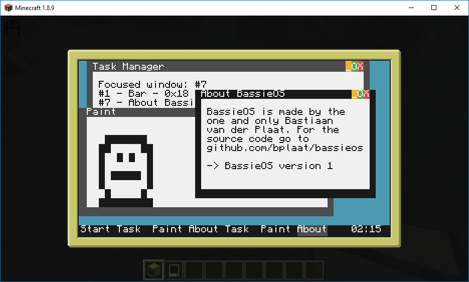
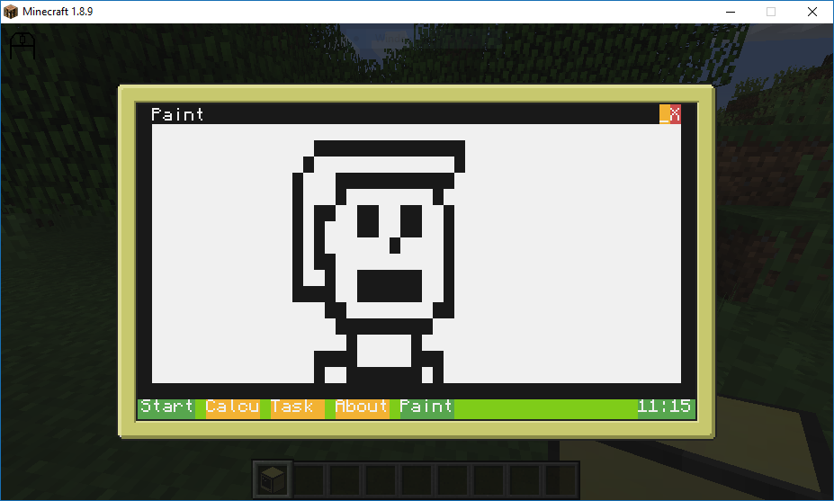
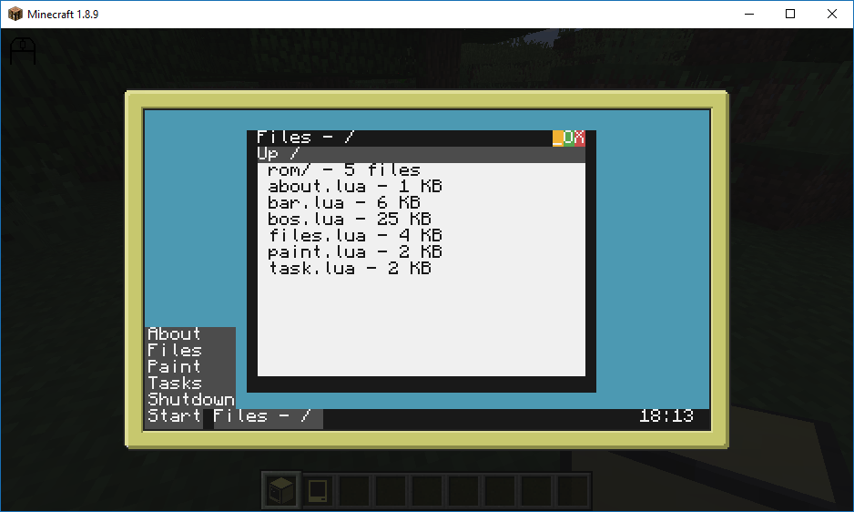

# bplaat/bassieos
A simple Operating System for the MineCraft ComputerCraft advanced color computer

## How to install?
Just copy all the files to an editor in CraftOS on your advanced color computer

## Some screenshots

## More information
For more information go to: http://www.computercraft.info/wiki/Main_Page