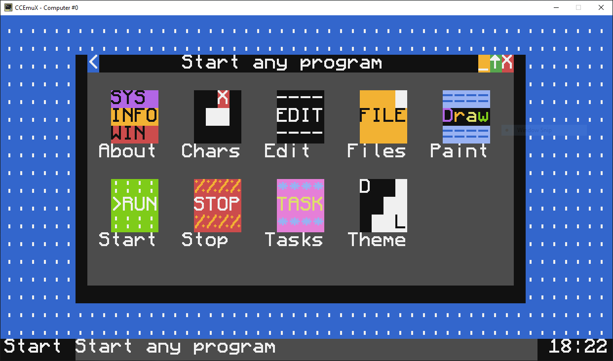
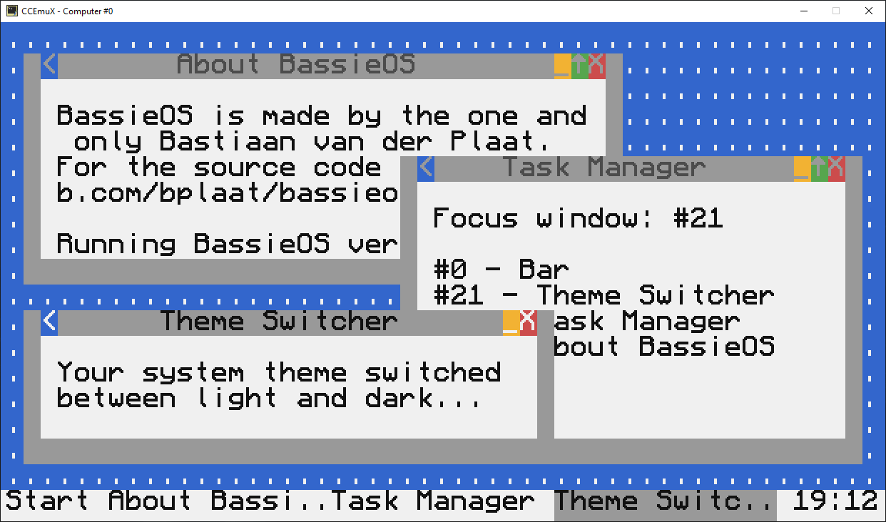
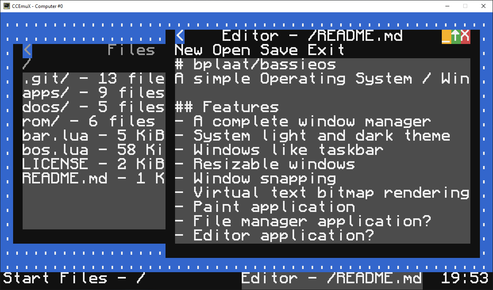

# bplaat/bassieos
A simple Operating System / Window Manger for the MineCraft ComputerCraft computers written in Lua

## Features
- A complete window manager
- System light and dark theme
- Windows like taskbar
- Resizable windows
- Window snapping
- Virtual text bitmap rendering
- File manager application?
- Paint application?
- Editor application?

## How to install?
To run this in Minecraft install the [ComputerCraft mod](https://www.computercraft.info/)

Or use a standalone [ComputerCraft emulator](https://emux.cc/)

And just copy all the files to the root of computer with CraftOS

Then type `bos.lua` in CraftOS to start the Operating System / Window Manager

## Screenshots
Here are some screenshots taken with the ComputerCraft emulator running BassieOS:

